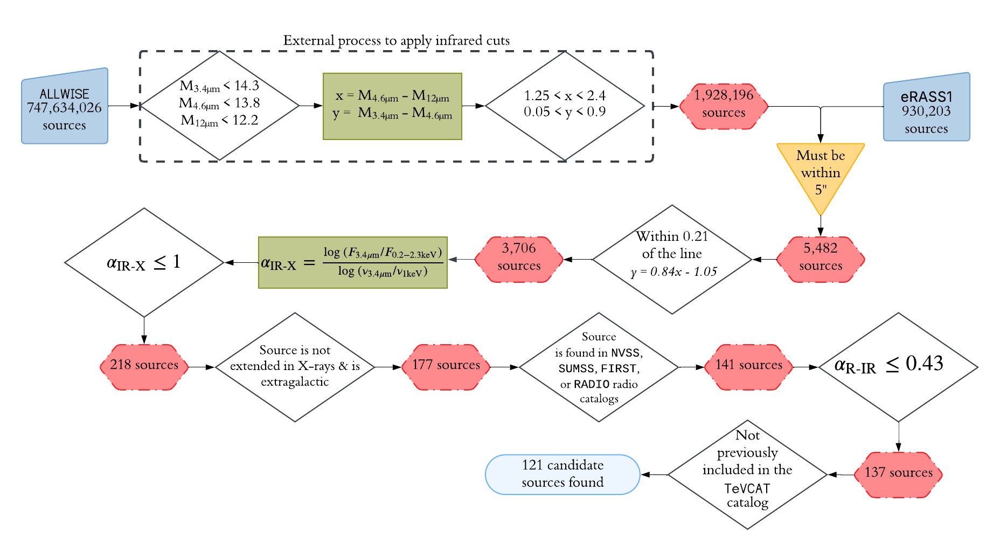

# THC-CAT
The code behind a catalog of 121 TeV-emitting HBL Candidates 

  
  <i>  Figure 1: The algorithm depicted in Figure 3 of Metzger, Gokus, & Errando (2025).</i>

## Data products
This repository contains two data sets: primary catalog [THC_catalog.fits](./CATALOGS/THC_catalog.fits) and supplementary catalog [WISE_EROSITA_ALLmatches.fits](./CATALOGS/WISE_EROSITA_ALLmatches.fits). 

[THC_catalog.fits](./CATALOGS/THC_catalog.fits) contains the 121 THC sources that pass all parameters detailed in Figure 1. It is produced using [THC_algorithm.ipynb](THC_algorithm.ipynb). 

[WISE_EROSITA_ALLmatches.fits](./CATALOGS/WISE_EROSITA_ALLmatches.fits) contains all 5482 sources that pass the IR magnitude and color cuts (Steps 1&2 in Section 3 of Metzger et al. 2025) and have WISEA and 1eRASS counterparts within 5'' of one another. 

## Scripts
Please note that all scripts have input files from a number of catalogs that are not included in this repository and must be retrieved separately. As a result, you will need to edit the paths in the scripts to match your local directory. 

[wise_filter.sh](wise_filter.sh) takes in the ALLWISE catalog and returns a revised catalog that contains only the sources that fall within magnitude and color cuts described in Figure 1. **This script must be run first.**

[THC_algorithm.ipynb](THC_algorithm.ipynb) selects 121 TeV-emitting HBL Candidate sources and cross-matches them with various multi-wavelength catalogs. The details of this script are shown in Figure 1. 

[WISE_EROSITA_ALLmatches.ipynb](WISE_EROSITA_ALLmatches.ipynb) selects 5482 sources that have ALLWISE counterparts within the accepted magntiudes and colors and have an eRASS1_Main counterpart within 5''. These 5482 sources are then cross-matched with the same multi-wavelength catalogs used in the THC algorithm. 

## Necessary files 

### Core catalogs
The following catalogs are vital to the algorithm and must be accessed separately. 
* eRASS1 (Merloni et al. 2024)
* ALLWISE (Cutri et al. 2013)
* TeVCAT[^1]
* Sydney University Molonglo Sky Survey (Mauch et al. 2003)
* Faint Images of the Radio Sky at Twenty cm (White et al. 1997; Helfand et al. 2015)
* NRAO VLA Sky Survey (Cordon et al. 1998)

### Catalogs for analysis 
The following catalogs are used to gain additional information about the 121 candidate sources.  

#### Optical 
* Gaia DR3 (Gaia Collaboration 2022) 

#### Gamma-ray 
* Second Catalog of High-Energy Fermi-LAT sources (Ackerman et al. 2016)
* Third Fermi-LAT Catalog of High-Energy Sources (Ajello et al. 2017)
* LAT 14-year Source Catalog (Ballet et al. 2024)
* Fourth Catalog of Active Galactic Nuclei Detected by the Fermi Large Area Telescope Data Release 3 (Ajello et al. 2023)
* First Cosmic Gamma-ray Horizon (Arsioli et al. 2025)

#### Multi-frequency 
* 5th edition Roma-BZCAT (Massaro et al. 2015)
* 3HSP (Chang et al. 2019)
* 1st edition WHSP (Arsioli et al. 2015)
* 2WHSP Catalog of High Synchrotron Peaked Blazars and Candidates (Chang et al. 2017)
* TeV-peaked candidate BL Lac objects (Costamante 2020)
* Two new catalogs of blazar candidates in the WISE Infrared sky (D'Abrusco et al. 2019)
* Exploring the Most Extreme Gamma-Ray Blazars Using Broadband Spectral Energy Distributions (Láinez et al. 2025)
* A new look at the extragalactic very high energy sky: Searching for TeV-emitting candidates among the X-ray-bright, non-Fermi-detected blazar population (Marchesi et al. 2025)
* BL Lac candidates for TeV observations (Massaro et al. 2013)

[^1]: [https://tevcat.org/](https://tevcat.org/)