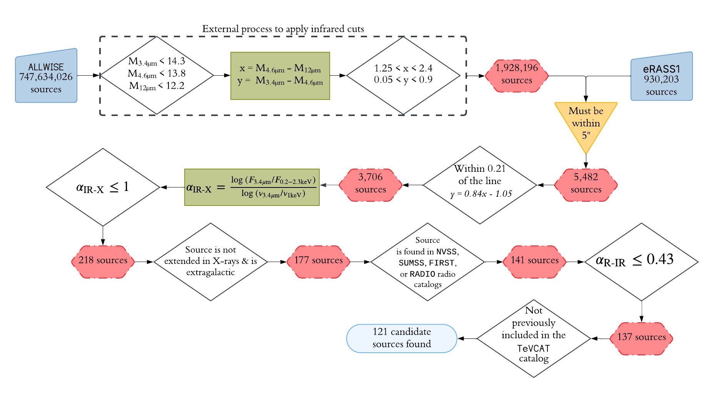

# THC-CAT
A catalog of 121 TeV-emitting High-frequency BL Lac candidates, selected using data from the ALLWISE and eROSITA DR1 data releases, alongside archival radio data. 

  
  <i>  Figure 1: The algorithm depicted in Figure 3 of Metzger, Gokus, & Errando (2025).</i>

## How it works
This is a Python-based algorithm that utilizes the `numpy`, `astropy`, `astroquery`, `subprocess`, `math`, and `os` Python packages. After downloading the repository, the algorithm can be simply run with the command `python THC_algorithm.py` 

However, `THC_algorithm.py` calls functions from the `wise_download.py`, `upload_catalogs.py`, and `table_formatting.py` files.  Unless you wish to change the algorithm's output file, you likely will not need to touch the `table_formatting.py`file. However, depending on how you choose to access the multi-wavelength catalogs the algorithm uses as inputs, you may need to make changes to the file paths of the `upload_catalogs.py` script. If you have already downloaded the ALLWISE catalog and/or the eRASS1 catalog, we recommend commenting out lines 40 and/or 41 of `THC_algorithm.py` to avoid re-downloading the files. 

Please note that this repository contains code to download the ALLWISE and eRASS1 catalogs because they are larger files, and it is best to avoid storing them on a personal computer. The radio catalogs SUMSS, FIRST, and NVSS are necessary for the radio matching algorithm, but you must retrieve them yourself. The same can be said for the catalogs used in the multi-frequency matching part of the script. To view a comprehensive list of the catalogs necessary for this algorithm, please visit the  "Necessary files" header. 

### wise_download.py 
This script is not necessary if you already have the *WISE* data you wish to run the algorithm on.  

`wise_download.py` retrieves the compressed version of the ALLWISE catalog, which has been split into 48 bzip2 files, each roughly 24 GB in size. **Please note that you will need 340 GB of disk space to download all 48 files, and an additional 1141 GB of disk space is required to handle the uncompressed files.**

Our script provides you with multiple options for downloading the ALLWISE catalog. While running, you will be prompted to answer which ALLWISE files you would like to download.  If you reply "all," the 48 files will begin downloading. As an alternative, you can respond with the specific file numbers you wish to download (e.g., "1,2,3" or "5,19,44,2"). See the 2013 ALLWISE data release  (Cutri et al. 2013) for information on the declinations spanned by each file. 

Because of the sheer size of the ALLWISE catalog, we have included a Boolean value on line 12 of the script that, when set to False, will only download the first 10 MB of each file. We have done this to allow users to quickly test and play around with the algorithm. **To download the entirety of each file, you must set download_full_files = True.**

The output of this script will be titled `./CATALOGS/ALLWISE.fits`. It will contain only columns 0, 1, 2, 16, 17, 20, 21, 24, 25 of the ALLWISE catalog (the WISE designation, right ascension, declination, and the magnitudes and errors in bands W1-W3). If you wish to change the columns stored in the output file, you can edit line 13 of the script. 

Furthermore, please note that the `wise_download.py` script performs the infrared magnitude and color cuts implemented in the algorithm to avoid storing an unnecessarily large data file. **If you choose NOT to use our method for downloading the WISE catalog, you must implement the infrared magnitude and color cuts yourself.**

### upload_catalogs.py 
This script includes commands for retrieving and accessing the 19 input catalogs necessary for this algorithm to run. It allows for both the ALLWISE and eRASS1 catalogs to be downloaded from their respective sources (Cutri et al. 2013, Merloni et al. 2024). The remaining 17 catalogs must be downloaded to your local machine individually. 

`upload_catalogs.py` assumes that all data files are stored in the `./CATALOGS` folder of the repository. Within this folder, we created subfolders titled "gammaray", "multiwavelength", and "radio." Below, we list all the external files (beyond the ALLWISE and eRASS1 catalogs) that are implemented in this algorithm. 

#### `./CATALOGS/radio`
* Sydney University Molonglo Sky Survey (Mauch et al. 2003)
* Faint Images of the Radio Sky at Twenty cm (White et al. 1997; Helfand et al. 2015)
* NRAO VLA Sky Survey (Cordon et al. 1998)

The `load_radio_catalogs()` command of `upload_catalogs.py` uploads all three catalogs listed above. 

#### `./CATALOGS/gammaray`
* Second Catalog of High-Energy Fermi-LAT sources (Ackerman et al. 2016)
* Third Fermi-LAT Catalog of High-Energy Sources (Ajello et al. 2017)
LAT 14-year Source Catalog (Ballet et al. 2024)
* Fourth Catalog of Active Galactic Nuclei Detected by the Fermi Large Area Telescope Data Release 3 (Ajello et al. 2023)
* First Cosmic Gamma-ray Horizon (Arsioli et al. 2025)

#### `./CATALOGS/multiwavelength`
* 5th edition Roma-BZCAT (Massaro et al. 2015)
* 3HSP (Chang et al. 2019)
* 1st edition WHSP (Arsioli et al. 2015)
* 2WHSP Catalog of High Synchrotron Peaked Blazars and Candidates (Chang et al. 2017)
* TeV-peaked candidate BL Lac objects (Costamante 2020)
* Two new catalogs of blazar candidates in the WISE Infrared sky (D'Abrusco et al. 2019)
* Exploring the Most Extreme Gamma-Ray Blazars Using Broadband Spectral Energy Distributions (Láinez et al. 2025)
* A new look at the extragalactic very high energy sky: Searching for TeV-emitting candidates among the X-ray-bright, non-Fermi-detected blazar population (Marchesi et al. 2025)
* BL Lac candidates for TeV observations (Massaro et al. 2013)

The command `load_analysis_catalogs()` will upload all gamma-ray and multiwavelength catalogs.  

### table_formatting.py
This is the shortest script in the repository. It simply creates two commands `get_THC_name(allwise, matches)` and `create_fits_table(astropy_table)`. If you wish to change the layout of the output table, you can do so by editing the `create_fits_table(astropy_table)` command. 

### THC_algorithm.py
This is the primary script in the repository. It calls `upload_catalogs.py` (which calls `wise_download.py`) and `table_formatting.py`. Within itself, `THC_algorithm.py` defines only one function outside of the main algorithm, and that is the distance function (`distance (m,b, x,y)`), which is used to determine the distance between a point on the WISE color-color diagram and the best-fit line.  

**PLEASE NOTE**: this algorithm assumes you are inputting a WISE catalog that is in the format output by the wise_download.py script (e.g., **the magnitude and color cuts have already been made**, the columns have specific names). 

The script proceeds as follows: 

1. Matches the ALLWISE and eRASS1 catalogs using the astropy SkyCoord and match_coordinates_sky(c, catalog) functions. We consider two sources to be a match if the X-ray coordinates fall within 5" of the IR source
2. Check the distance to the best-fit line defined in Metzger et al. (2025) using the `distance (m,b, x,y)` function. The distance must be < 0.21. 
Perform the Alpha_XIR cut (see Eq. 1 of Metzger et al. 2025). 
3. Remove sources that are extended in the X-rays (`EXT_LIKE` !=0) and remove sources that fall within 10˚ of the galactic plane 
4. Match with the radio catalogs SUMSS, FIRST, and NVSS. If a match is not found, we use the `Heasarc.query_region` of `astroquery` to search the RADIO master catalog. Please note that in order to retrieve the radio frequency for sources found to have only a flux in the `Flux_Other` band, we pulled a list of the catalogs that provide fluxes in this band and their corresponding frequencies from HEASARC
6. We exclude all sources with radio counterparts > 5" from their IR coordinates 
7. We apply the Alpha_RIR cut (again, see Metzger et al. 2025 for more details) 
8. We remove all sources that are found in the TeVCAT catalog

At this point, our selection of 121 TeV-emitting HBL candidates is complete.

To conclude, we search for counterparts for our candidate sources in various gamma-ray and multiwavelength catalogs and format our output catalog according to `table_formatting.py` script. 

For more details on this algorithm, see Figure 3 and Section 3 of Metzger et al. (2025). 

## Data products
This repository contains two data sets: the primary catalog `THC_catalog.fits` and the supplementary catalog `WISE_EROSITA_ALLmatches.fits`. `THC_catalog.fits` contains 121 sources, all of which pass the algorithm defined in Metzger et al. (2025). `WISE_EROSITA_ALLmatches.fits` contains the 5,482 sources that pass the IR magnitude and color cuts (steps 1 and 2 of Metzger et al. 2025) and fall within 5" of an eRASS1 source. Both can be found in the `./CATALOGS/ folder`. 